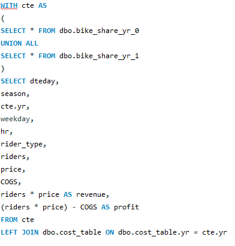
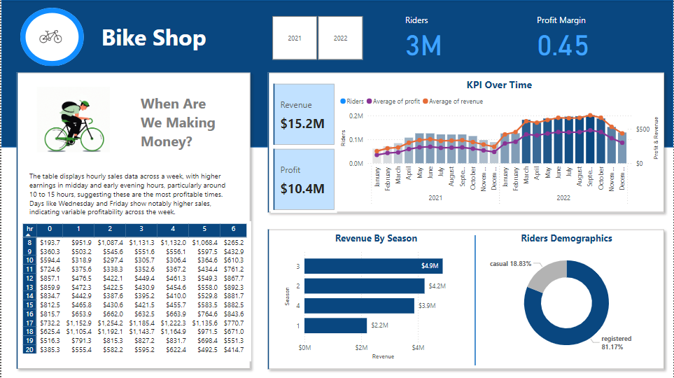
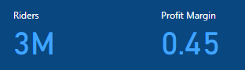
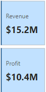
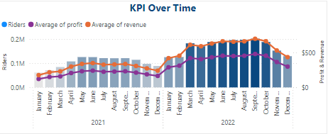
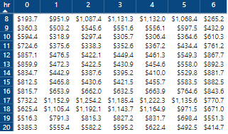
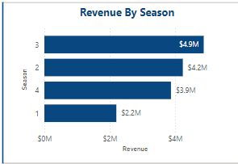

# Bike shop sales performance

## Overview

This user story outlines the specifications for building a dashboard using Power BI to help the bike shop show the sales performance through 2021 and 2022. 

## Data Source

The dataset is coming from GitHup in 3 csv files [see here to find it.](https://github.com/Gaelim/YT_bike_share).

## Merging the data files

Using SQL we merge the two bikes data files which includes the data for 2021 and 2022 then extracting the needed columns and joining them with the cost tableusing the year column.

## Sales Dashboard | Requirements

## Dashboard Purpose

The purpose of the dashboard is to present an overview of the revenue and profit over time and show what is the most profitable season.

## Key Requirements

### KPI Overview

Display a summary of total riders, revenue, profit and profit margin.

### Revenue and Profit Over Time
 
 
Present the data for total riders, revenue and profit in a line and clustered column chart.

 

### Average Revenue Per Hour Each Weekday
 
 
Compare the average revenue in hour in each weekday in a simple table.

### Revenue Per Season
 
 
Present the difference of total revenue in each season in a line chart.

## Conclusion

1- The highest average revenue is generated between 3 PM and 7 PM.
2- The highest average revenue is observed between March and October.
3- The third season is the most profitable.
4- The most common rider type is registered users.

